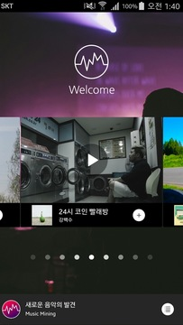

# 뮤직 마이닝(MusicMining) 🎵
## 1. 기획 의도
- 뮤직마이닝은 소비자가 숨어있는 명곡을 짧은 시간 안에 최대한 많이 발견하고 손 쉽게 일상생활에서 감상할 수 있도록 도와 인디음악의 대중화를 추구합니다.

## 2. 개발 기간
- 대학생 연합 IT창업동아리 S.O.P.T 앱잼에서 뮤직마이닝팀으로 뮤직마이닝 안드로이드 어플을 개발했습니다 
- 2016.12.26 ~ 2017.1.7 

## 3. 프로젝트에서 맡았던 역할
- 동영상 플레이어 부분을 개발했습니다. 
- 20초동안 하이라이트 동영상을 보고, 마음에 들면 그 음악을 플레이리스트에 저장해 들을 수 있습니다.

## 4. 실행 화면
Gif는 동영상 플레이어 부분만 나옵니다. Video를 클릭하시면 앱 전체 영상을 볼 수 있습니다.

| Gif | Video |
| --- | --- |
|  |  |
  
## 5. 개발환경
- Java
- retorift2
- RecyclerView
- [오픈소스 동영상 플레이어](https://github.com/xiongwei-git/AndroidVideoPlayer)를 보고, 코드를 분석하고 활용하여 사용 하였습니다
